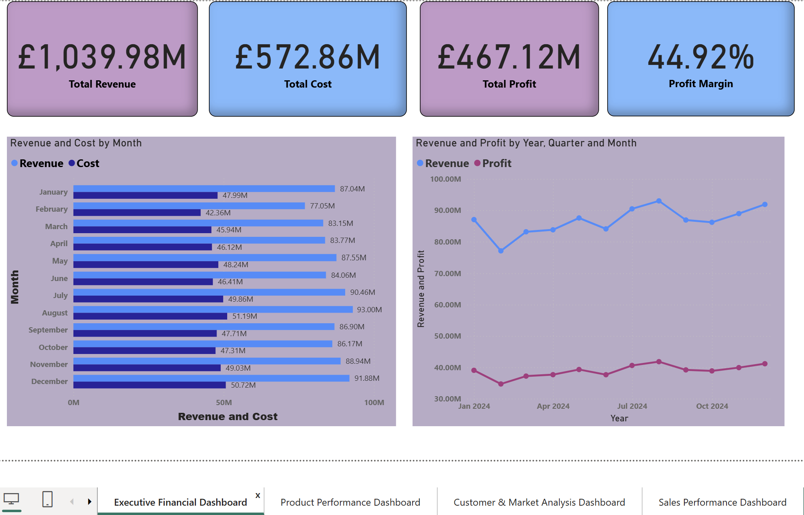
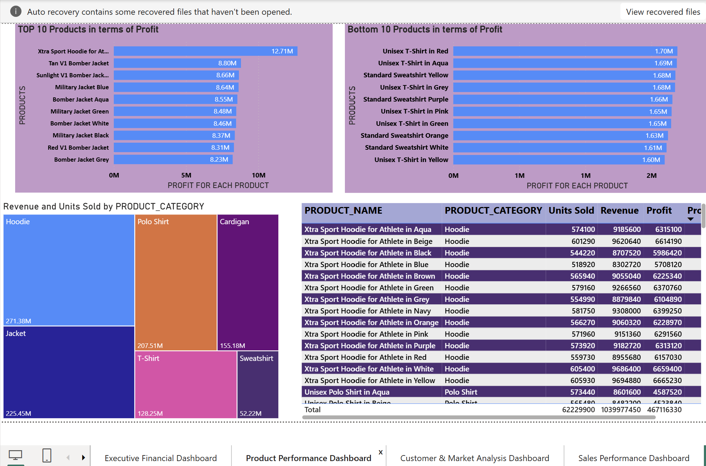
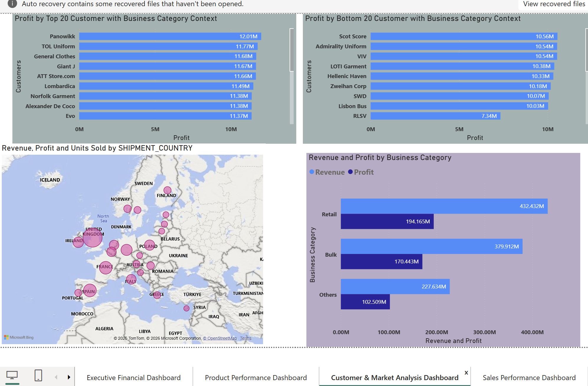
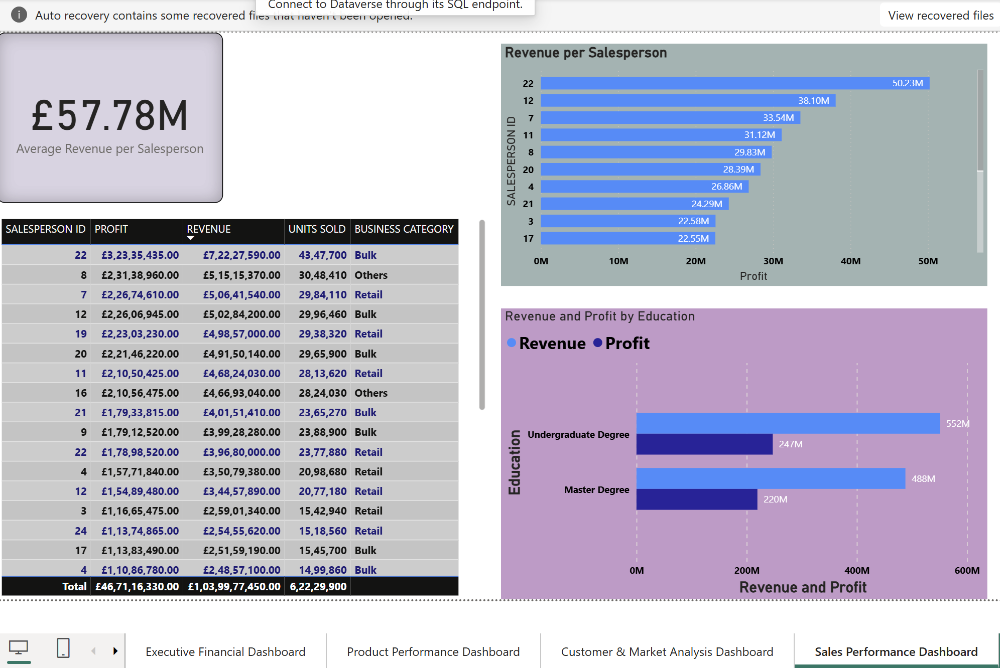
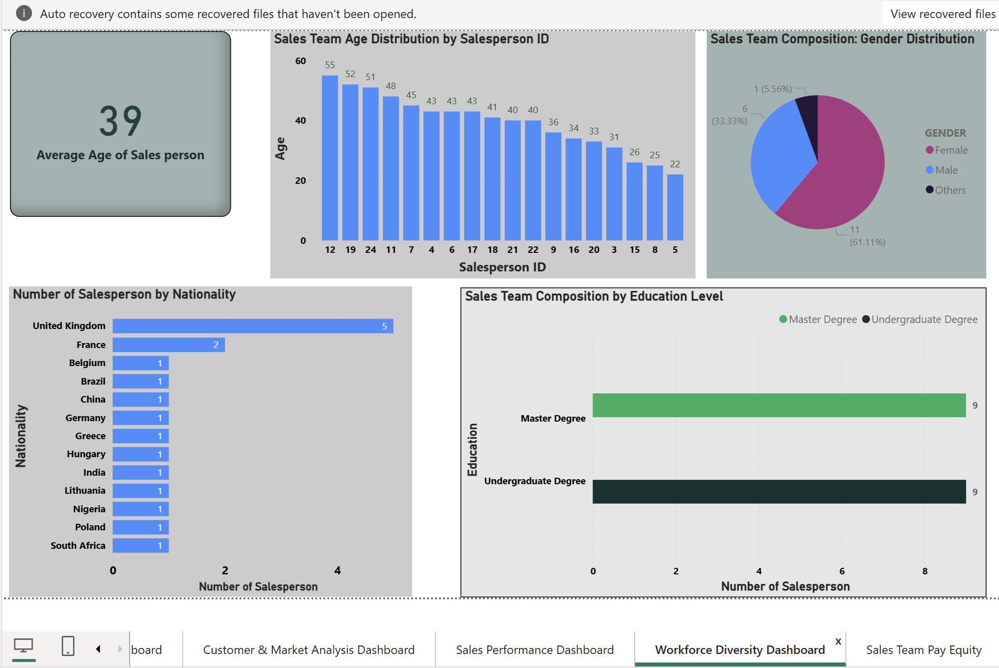
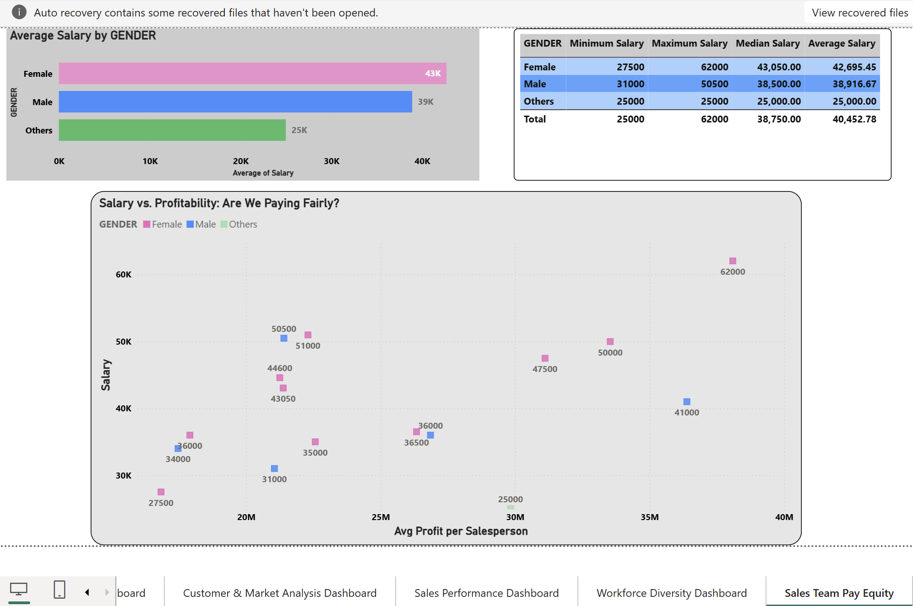

# Garment Manufacturing Business Intelligence Dashboard

## Project Overview

This project demonstrates the development of an end-to-end Power BI Business Intelligence solution for a garment manufacturing company.

The dashboard provides insights into:

- Financial Performance
- Product Profitability
- Customer and Market Analysis
- Salesperson Performance
- Workforce Diversity and Inclusion
- Pay Equity Analysis

## Tools Used

- Power BI
- Power Query
- DAX
- Excel
- CSV
- JSON

## Dashboard Pages

### Executive Financial Dashboard

### Product Performance Dashboard

### Customer and Market Analysis Dashboard

### Sales Performance Dashboard

### Workforce Diversity Dashboard

### Pay Equity Dashboard

## Data Model

## Skills Demonstrated

- Data Cleaning
- Data Transformation
- Data Modeling
- DAX Measures
- Dashboard Design
- Business Intelligence
- Data Storytelling
